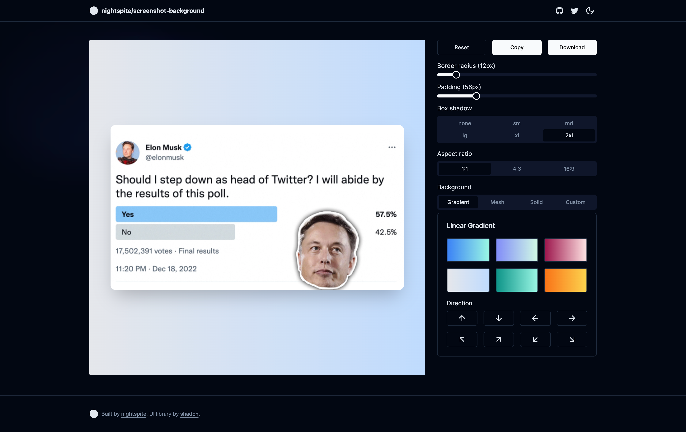

# nightspite/screenshot-background



## Motivation

After using [Cleanshot X](https://cleanshot.com/) for a while, the simple screenshots aren't doing it for me anymore. Unfortunately, Cleanshot is only available on macos, so I created a small reproduction of their background feature.

## Features

- [x] gradient background
- [x] gradient direction
- [x] mesh background
- [x] solid color background (tailwind pallete)
- [x] custom css
- [x] border radius
- [x] padding
- [x] box shadow
- [x] aspect ratio
- [x] proper image scaling
- [ ] save favorites?
- [ ] custom bg image
- [ ] bg image position
- [ ] bg blur
- [ ] bg opacity
- [ ] screenshot alignment

## Known issues

- [] generating correct image from dom doesn't work on safari [link](https://github.com/tsayen/dom-to-image#browsers)
- [] copy to clipboard won't work on safari [link](https://developer.mozilla.org/en-US/docs/Web/API/Clipboard)
- [] copy to clipboard won't work on firefox [link](https://developer.mozilla.org/en-US/docs/Web/API/Clipboard)

## Development

```bash
# Install dependencies
yarn

# Run the app
yarn dev

# Build the app
yarn build
```

## Credits

- UI Library: [shadcn/ui](https://ui.shadcn.com/)
- Gradient & Mesh Generator [hypercolor](https://hypercolor.dev/)
